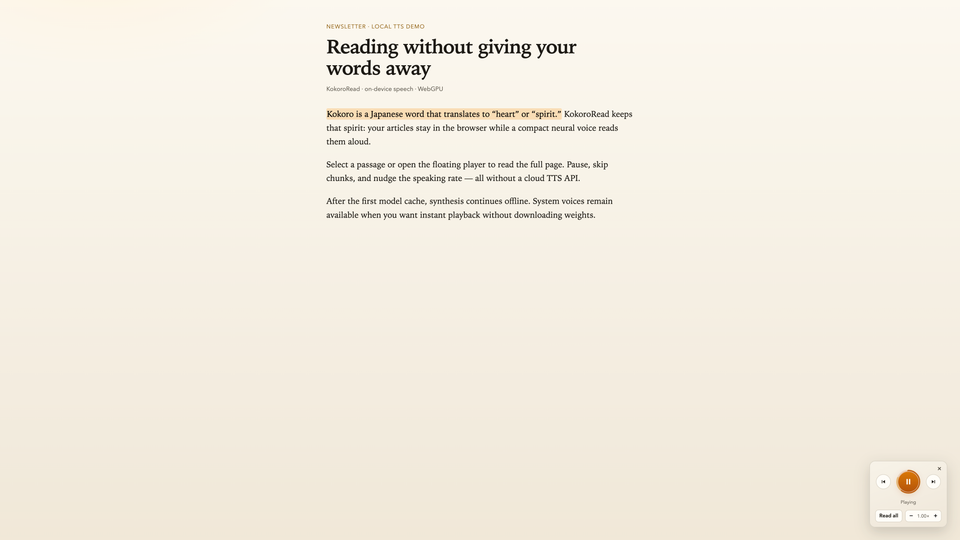
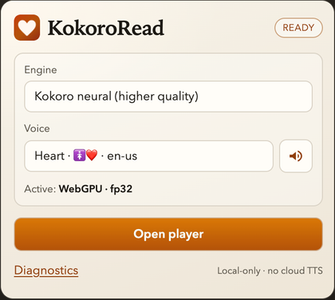
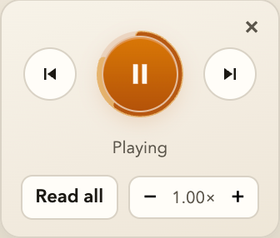
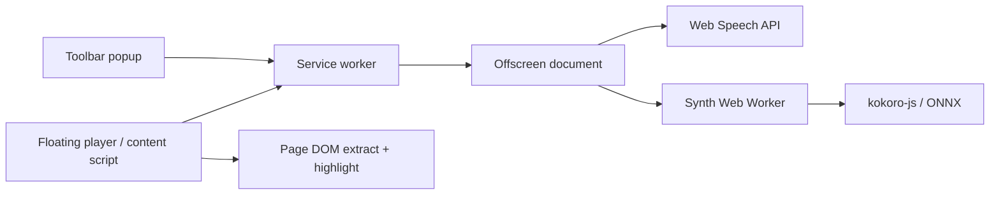

# KokoroRead

KokoroRead is a **Chrome Manifest V3 extension** that reads web pages aloud. It can speak selected text or extract main article / newsletter content, then play it through either:

- **System voices** — the browser Web Speech API (`speechSynthesis`), available immediately; or
- **Kokoro neural TTS** — on-device synthesis via [`kokoro-js`](https://www.npmjs.com/package/kokoro-js) (ONNX / Transformers.js) after the model assets are downloaded and cached.

<p align="center">
  
</p>

<p align="center">
  
</p>

| Toolbar popup | Floating player |
| --- | --- |
|  |  |

Static HTML used for these captures: [`docs/demo/`](docs/demo/).

## Features

- Choose **System voices (fast)** or **Kokoro neural (higher quality)** in the toolbar popup
- Open an on-page **floating player** (drag to move)
- **Read all** — extract and read the main article / newsletter body (heuristic)
- Select text on the page while the player is open to start reading that selection
- Play / pause, skip previous / next chunk, speaking rate −/+ (0.5×–2.0×)
- In-page sentence and word highlighting (CSS Highlight API) during playback
- Voice picker; Kokoro voices show gender markers (🚺 / 🚹) and optional trait emojis when metadata provides them
- Sample utterance from the popup speaker button
- Engine, voice, and rate persisted in `chrome.storage.local`
- Diagnostics panel (resolved backend, dtype, model id, errors)
- For Kokoro: WebGPU when available, otherwise WASM; model weights cached in the browser after first download

There is no account, API key, or companion app. There is also no Chrome Web Store listing or release package in this repository today — install by building and loading unpacked (see [Installation](#installation)).

## How it works

1. You open the popup and click **Open player** on a readable tab (or the player is already open).
2. KokoroRead obtains text either from your selection or from article / newsletter extraction in the content script.
3. Text is split into speech-sized chunks (offsets preserved for highlighting).
4. Audio is produced by the selected engine:
   - **System** — `speechSynthesis` in the offscreen document
   - **Kokoro** — `KokoroTTS` in a Web Worker attached to the offscreen document (WebGPU or WASM)
5. Playback runs in the offscreen document; progress and highlights sync back to the floating player and page.



| Context | Role |
| --- | --- |
| Popup (`src/popup/`) | Engine / voice / sample / open player / diagnostics |
| Service worker (`src/background/`) | Offscreen lifecycle, settings, tab messaging, stop on tab switch |
| Content script (`src/content/`) | Extraction, floating player UI, CSS Highlight API |
| Offscreen (`src/offscreen/`) | TTS orchestration, chunk queue, Web Audio / `speechSynthesis` |
| Synth worker | Kokoro model load + `generate()` |

## Privacy and network behavior

KokoroRead does **not** implement its own cloud TTS API, analytics, or telemetry in this repository’s source. Speech pipelines differ by engine:

| Category | Behavior |
| --- | --- |
| Webpage text | Passed between extension contexts (content script ↔ service worker ↔ offscreen) via Chrome messaging. The extension code does not POST page text to a KokoroRead backend. |
| Kokoro model / assets | First Kokoro use calls `KokoroTTS.from_pretrained("onnx-community/Kokoro-82M-v1.0-ONNX")` through Transformers.js. That downloads model assets over HTTPS (Hugging Face hub / CDN as used by the library). Successful downloads are stored in a Cache API cache named `transformers-cache`. Packaged ONNX Runtime WASM files are loaded from the extension (`dist/wasm/`). |
| Speech generation (Kokoro) | Inference runs locally in the extension worker after assets are available. |
| Speech generation (System) | Uses `window.speechSynthesis`. Voices marked `localService` are on-device; others may use network speech services provided by the OS/browser. The UI labels those as `network` in voice traits when listing system voices. |
| Analytics / telemetry | No analytics or telemetry SDK appears in `src/`. Project owners should still confirm packaging and dependency behavior before making stronger privacy claims. |
| Permissions | See [Permissions](#permissions). |

**Offline:** After Kokoro assets are cached, diagnostics can report `offlineCapable` when the model is ready. System mode does not download the Kokoro model; whether system voices work offline depends on the selected voice and the browser/OS.

## Requirements and compatibility

| Item | Verified detail |
| --- | --- |
| Browser | Built and documented as a **Chrome** MV3 extension (`chrome.*` APIs, `chrome://extensions`, `chrome.offscreen`) |
| Manifest | Version **3** (`public/manifest.json`) |
| Engines | `system` (default) and `kokoro` |
| Kokoro compute | Preference forced to **auto** in the popup: try **WebGPU** (`fp32` default), fall back to **WASM** (`q8` default) |
| Storage | Settings key `kokoroRead.settings` in `chrome.storage.local` |
| Restricted pages | Cannot run on `chrome://`, `chrome-extension://`, `edge://`, `about:`, or Chrome Web Store URLs (see service worker checks) |

Firefox / Safari / Edge store packaging is not configured in this repo. WebGPU availability depends on the user’s Chrome environment; WASM is the fallback path in code.

## Installation

Prerequisites: **Node.js** and **npm** (this repo ships `package-lock.json`).

```bash
git clone <this-repository-url>
cd KokoroRead
npm install
npm run build
```

Load the unpacked build in Chrome:

1. Open `chrome://extensions`
2. Enable **Developer mode**
3. **Load unpacked** → select the **`dist/`** folder (Vite `outDir`)
4. Pin **KokoroRead**, open the popup, click **Open player** on a normal https page

After code changes, run `npm run build` (or `npm run dev` for watch mode) and click **Reload** on the extension card in `chrome://extensions`. The content script is a separate IIFE build (`content.js`); always reload the extension (and refresh the tab) after rebuilding.

### Optional zip

```bash
npm run package
```

Builds, then zips `dist/` to `kokororead.zip` in the repo root (zip is gitignored). There is no published Web Store link in this repository.

## Usage

1. Open a readable webpage (not a restricted Chrome URL).
2. Click the KokoroRead toolbar icon.
3. Under **Engine**, choose **System voices (fast)** or **Kokoro neural (higher quality)**.
4. Pick a **Voice**. Optionally press the speaker button to **Play sample**.
5. Click **Open player** — the floating panel appears on the page.
6. Click **Read all** to extract and read the main content, **or** select text on the page to read the selection (while the player is open).
7. Use play/pause, previous/next chunk, and rate −/+ as needed. **×** closes the player and stops playback.
8. Switching away from the player tab stops playback (by design).

Exact control labels match the UI in `src/popup/App.tsx` and `src/content/floating-player.ts`.

## Permissions

From `public/manifest.json`:

| Permission / host access | Why KokoroRead needs it |
| --- | --- |
| `activeTab` | Work with the tab the user is interacting with when opening the player or extracting text |
| `scripting` | Inject `content.js` when the content script is not already present |
| `storage` | Persist engine, voice, rate, and related settings in `chrome.storage.local` |
| `offscreen` | Keep an offscreen document for audio playback and the Kokoro worker |
| `tabs` | Resolve the active tab, message the player tab, and stop reading when the user switches tabs |
| Host access `<all_urls>` (permission + content script matches) | Run extraction, highlighting, and the floating player on ordinary web pages the user visits |

## Development

```bash
npm install
npm run dev        # vite build --watch (reload the extension in Chrome after rebuilds)
npm run build      # tsc -b && vite build && content-script IIFE build
npm run build:ext  # vite builds only (skips tsc -b)
npm run typecheck
npm run lint       # oxlint src
npm run screenshots  # prints how to regenerate docs/demo captures
```

There is no `test` script in `package.json`.

### Layout

```
public/manifest.json   MV3 manifest
public/icons/          Extension icons
popup.html             Popup shell
offscreen.html         Offscreen shell
src/popup/             React popup
src/background/        Service worker
src/content/           Extraction, highlight, floating player
src/offscreen/         TTS engine, queue, audio, synth worker
src/shared/            Types, messages, storage, chunking
docs/demo/             Static UI demos for screenshots
docs/screenshots/      README images
scripts/               Screenshot helper notes
```

Build notes live in `vite.config.ts` (popup, offscreen, background, WASM copy) and `vite.content.config.ts` (single-file `content.js` IIFE).

## Technical notes

- **Kokoro path:** `kokoro-js` + `@huggingface/transformers` + ONNX Runtime; model id `onnx-community/Kokoro-82M-v1.0-ONNX` (`KOKORO_MODEL_ID` in `src/shared/types.ts`). Chrome-specific cache / Content-Length fixes: `src/offscreen/transformers-chrome.ts`.
- **System path:** `src/offscreen/system-speech.ts` wraps `speechSynthesis`; no Kokoro download.
- **Chunking:** `src/shared/chunking.ts` — moderate segments with offsets for highlights; Kokoro queue pipelines synth ahead of playback (`src/offscreen/queue.ts` + Web Audio in `audio-player.ts`).
- **Highlighting:** content script maps spoken offsets to DOM ranges (`text-map.ts`) and applies `CSS.highlights` (`page-highlight.ts`).
- **Messaging:** typed contracts in `src/shared/messages.ts` across popup, service worker, offscreen, and content.
- **Settings defaults:** engine `system`, backend `auto`, rate `1.0`; default Kokoro voice id `af_heart` when switching to neural.

Streaming via `tts.stream()` is not wired; synthesis is chunked batch generation.

## Limitations

- Chrome MV3 only in this repository’s packaging and docs; other browsers are untested here.
- Restricted URLs cannot be scripted (see [Requirements](#requirements-and-compatibility)).
- Article / newsletter extraction is heuristic; complex or app-like DOMs (including mail clients) may extract poorly or fall back to `document.body`.
- First Kokoro session needs a network download of model assets; size is not measured in this repo.
- Kokoro speed and memory use depend on WebGPU vs WASM and hardware.
- System and Kokoro voices sound different; some system voices may use network speech services.
- Highlighting requires browser support for the CSS Highlight API; mapping can fail when the spoken text no longer matches the live DOM.
- Playback stops when you leave the player tab.

## License

Extension code: [MIT License](./LICENSE).

Third-party components retain their own licenses. In particular, the `kokoro-js` package declares **Apache-2.0**; ONNX model weights and other upstream assets follow the terms published by their distributors (see the [`onnx-community/Kokoro-82M-v1.0-ONNX`](https://huggingface.co/onnx-community/Kokoro-82M-v1.0-ONNX) model card and dependency metadata). This README does not assert a single license for all model artifacts.

## Contributing

Issues and pull requests are welcome. Use the [Development](#development) section for local setup. There is no separate `CONTRIBUTING.md` in this repository.
